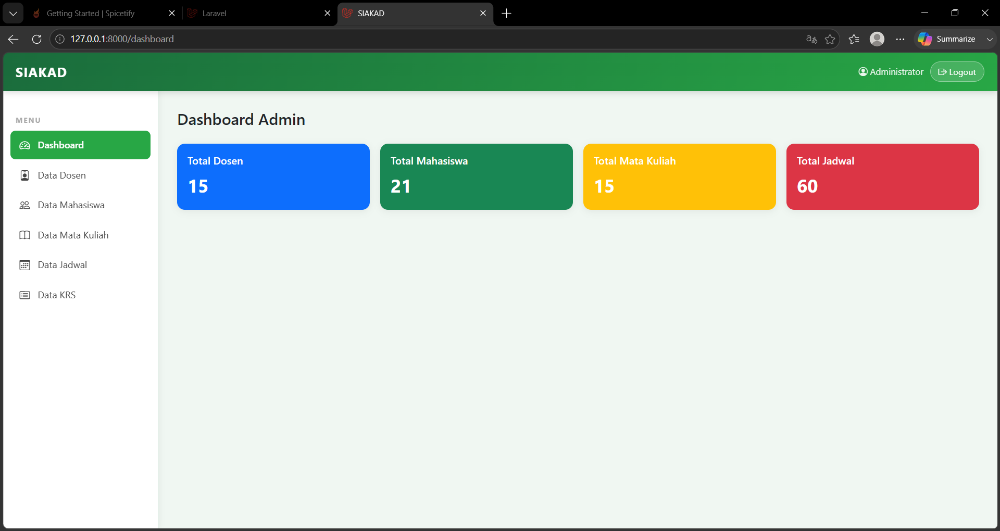
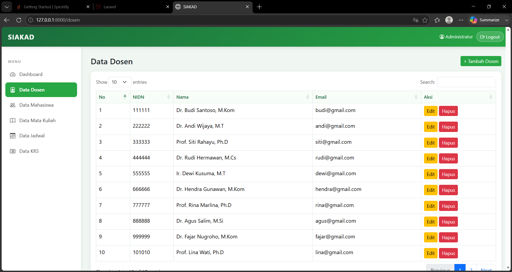
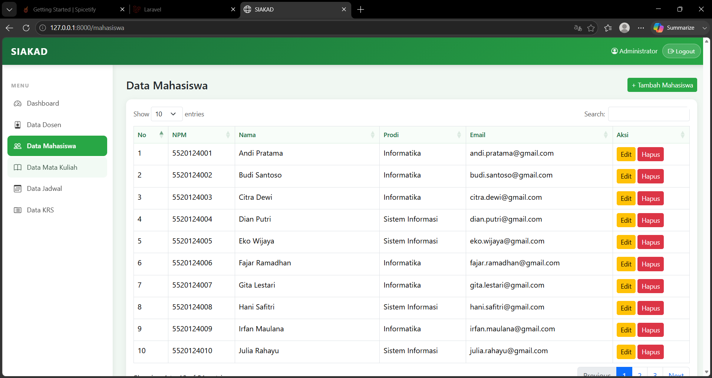
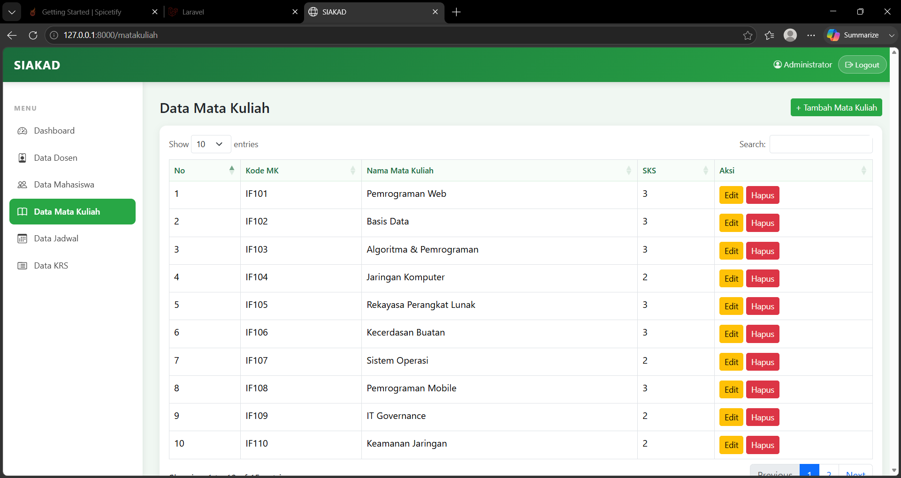
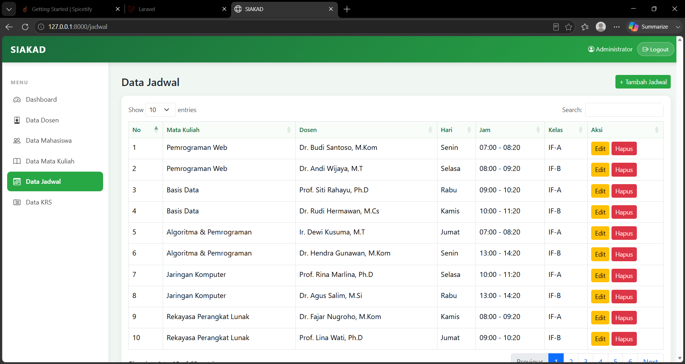
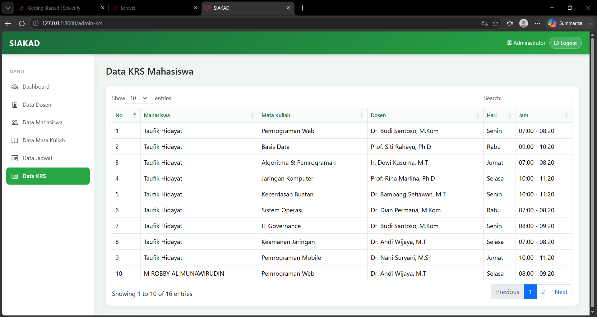
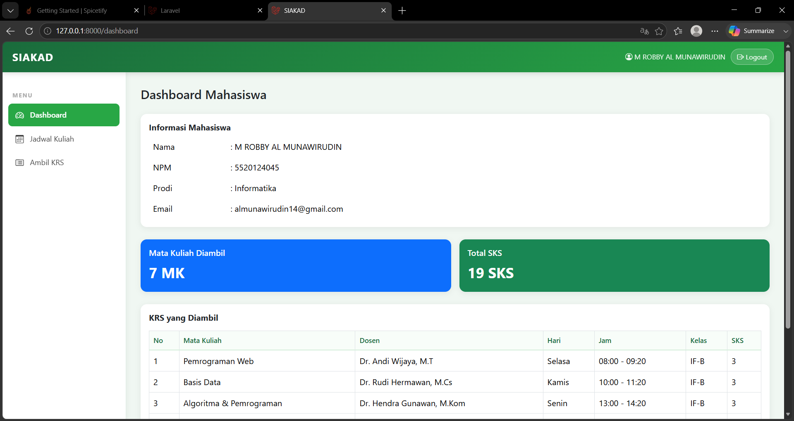
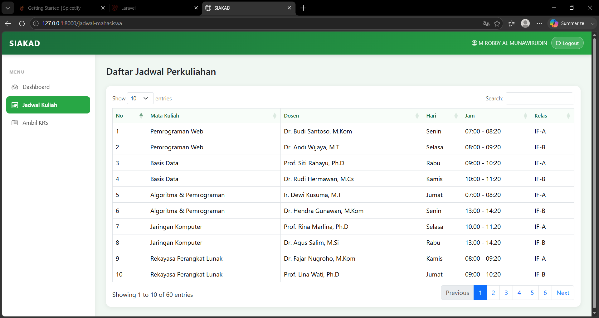
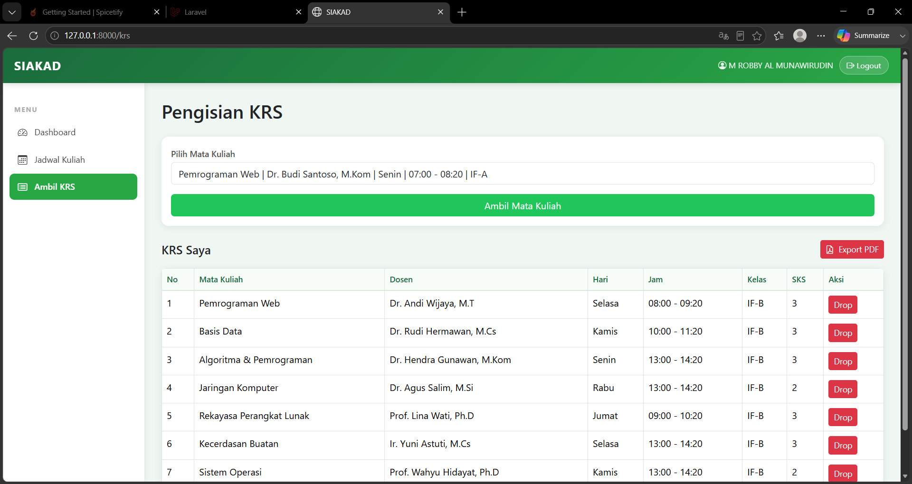

# Tugas Besar SIAKAD - IFB2024 - 5520124045 - M Robby Al Munawirudin

## A. Tentang Aplikasi Ini

**SIAKAD (Sistem Informasi Akademik)** adalah platform web yang dibuat untuk mempermudah pengelolaan data perkuliahan di kampus. Mulai dari mengelola data dosen, mahasiswa, dan mata kuliah, mengatur jadwal belajar-mengajar, hingga proses mahasiswa mengambil mata kuliah (KRS) secara online — semuanya terintegrasi dalam satu sistem. Aplikasi ini juga telah di hosting melalui InfinityFree dengan Link sebagai Berikut : [thisrobby.page.gd](https://thisrobby.page.gd)

---

## B. Akun Demo

### Admin
- **Email:** `admin@gmail.com`
- **Password:** `admin123`

### Mahasiswa
- **Email:** `almunawirudin14@gmail.com`
- **Password:** `MRobby140506`

---

## C. Menu & Kegunaan Tiap Halaman

1. **Dashboard Admin** — Menampilkan statistik jumlah dosen, mahasiswa, mata kuliah, dan jadwal yang terdaftar di sistem.
2. **Data Dosen** — Admin dapat melihat, menambah, mengedit, dan menghapus data dosen berdasarkan NIDN.
3. **Data Mahasiswa** — Admin mengelola data mahasiswa aktif lengkap dengan NPM, nama, prodi, dan email.
4. **Data Mata Kuliah** — Mengelola daftar mata kuliah beserta kode MK dan bobot SKS.
5. **Data Jadwal** — Admin meracik jadwal kuliah dengan mencocokkan mata kuliah, dosen, kelas, hari, dan jam.
6. **Data KRS (Admin)** — Admin dapat memantau seluruh KRS yang diambil oleh semua mahasiswa.
7. **Dashboard Mahasiswa** — Mahasiswa dapat melihat informasi diri, jumlah MK yang diambil, dan total SKS.
8. **Jadwal Kuliah** — Mahasiswa dapat melihat seluruh jadwal perkuliahan yang tersedia.
9. **Kartu Rencana Studi (KRS)** — Mahasiswa memilih mata kuliah yang akan diambil, melihat total SKS, dan dapat mencetak bukti KRS ke PDF.

---

## D. Dokumentasi Screenshot

### Bagian Admin

#### 1. Dashboard Admin

#### 2. Data Dosen

#### 3. Data Mahasiswa

#### 4. Data Mata Kuliah

#### 5. Data Jadwal

#### 6. Monitoring KRS Mahasiswa

---

### Bagian Mahasiswa

#### 1. Dashboard Mahasiswa

#### 2. Jadwal Kuliah

#### 3. Kartu Rencana Studi (KRS)

